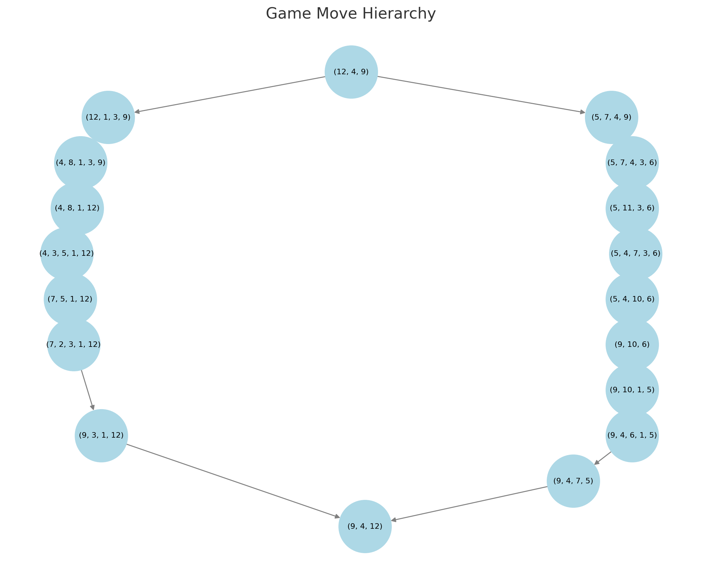
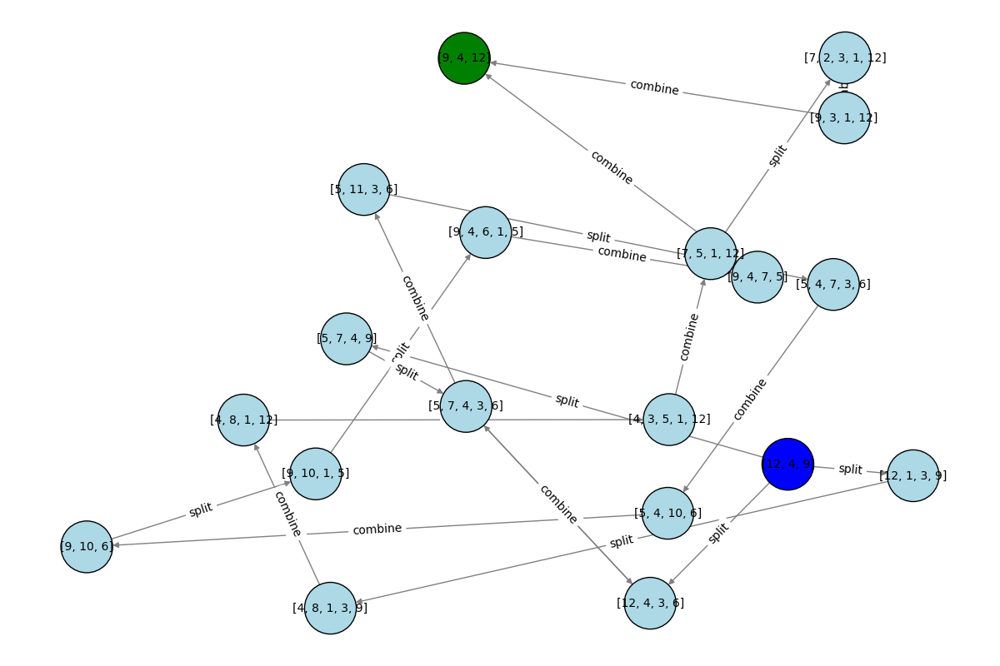

# Über die Berechenbarkeitstheorie anhand eines einfachen Puzzle-Spiels

## Einführung

Unter den Puzzle-Spielen gibt es eines, das sich durch seine faszinierende Mischung aus Einfachheit und Komplexität auszeichnet: ein Spiel, bei dem das Ziel darin besteht, eine Liste einzigartiger Ganzzahlen umzukehren, wobei nur zwei spezifische Operationen erlaubt sind. Das Spiel beginnt mit einer zufälligen Liste positiver, eindeutiger Ganzzahlen, und die Herausforderung besteht darin, diese Liste mit möglichst wenigen Zügen umzukehren. Die beiden zulässigen Operationen sind: das Aufteilen einer Zahl in zwei kleinere Zahlen, deren Summe der ursprünglichen Zahl entspricht, sowie das Zusammenführen zweier benachbarter Zahlen zu ihrer Summe. Diese Operationen unterliegen jedoch Einschränkungen: Alle resultierenden Zahlen müssen einzigartig bleiben und dürfen die größte Zahl der ursprünglichen Liste nicht überschreiten.

Dieses Puzzle-Spiel stellt besondere Herausforderungen dar, die es weit mehr als nur zu einer einfachen Umkehrübung machen. Es erfordert strategisches Denken und Optimierung, da jeder Zug sorgfältig überlegt sein muss, um sicherzustellen, dass die Bedingungen nicht verletzt werden. Die Faszination des Spiels liegt in seiner trügerischen Einfachheit, die eine tiefgehende Komplexität verbirgt, die verschiedene Bereiche der Berechenbarkeitstheorie berührt. Die Aufgabe, die optimale Zugfolge zu finden, ähnelt einigen der schwierigsten Probleme der Informatik, etwa NP-harten Problemen, bei denen es einfach ist, eine Lösung zu finden, aber extrem schwierig, die optimale Lösung zu bestimmen.

Dieses Puzzle dient als faszinierender Einstieg in Diskussionen über Berechenbarkeitstheorie, algorithmische Komplexität und Optimierungsstrategien und bietet Einblicke in die Art und Weise, wie einfache Regeln zu komplexen Problemlösungsszenarien führen können.

## Grundlegende Konzepte

### Einzigartige Ganzzahlen und ihre Operationen

Im Puzzle-Spiel drehen sich die grundlegenden Operationen um die Manipulation einer Liste einzigartiger Ganzzahlen. Jede Zahl in der Liste ist eindeutig, und die erlaubten Operationen sind darauf ausgelegt, diese Einzigartigkeit beizubehalten, während die Liste transformiert wird. Die beiden Hauptoperationen sind das **Aufteilen** und das **Zusammenführen** von Zahlen.

**Aufteilen einer Zahl:**

- **Konzept:** Eine Zahl \( I \) wird in zwei kleinere Ganzzahlen \( a \) und \( b \) zerlegt, sodass \( a + b = I \). Dabei muss sichergestellt sein, dass sowohl \( a \) als auch \( b \) positiv und von allen anderen Zahlen in der aktuellen Liste verschieden sind.

- **Beispiel:** Hat man die Zahl 9, könnte sie in 4 und 5 oder in 3 und 6 aufgeteilt werden, solange weder 4, 5, 3 noch 6 bereits in der Liste vorhanden sind.

Hier eine einfache Python-Demonstration für das Aufteilen einer Zahl:

```python
def split_integer(I, existing_numbers):
    """Splits an integer I into two distinct parts a and b such that a + b = I."""
    for a in range(1, I):
        b = I - a
        if a != b and a not in existing_numbers and b not in existing_numbers:
            return (a, b)
    return None

# Example usage
initial_list = [9, 15, 7]
result = split_integer(9, initial_list)
print(f"Splitting 9 results in: {result}")  # Output could be (4, 5) or (3, 6) depending on the existing list
```

**Zusammenführen von Zahlen:**

- **Konzept:** Zwei benachbarte Zahlen \( a \) und \( b \) in der Liste werden zu ihrer Summe \( I = a + b \) zusammengeführt. Die resultierende Zahl \( I \) muss einzigartig sein und darf nicht größer als die größte Zahl aus der ursprünglichen Liste sein.

- **Beispiel:** Falls die Liste die benachbarten Zahlen 4 und 5 enthält, können sie zu 9 kombiniert werden – vorausgesetzt, dass 9 nicht bereits in der Liste vorhanden ist und nicht größer als die größte Zahl der ursprünglichen Liste ist.

Hier eine einfache Python-Demonstration für das Zusammenführen von zwei Zahlen:

```python
def combine_integers(a, b, initial_max):
    """Combines two integers a and b into their sum, ensuring it doesn't exceed initial_max."""
    combined = a + b
    if combined <= initial_max:
        return combined
    return None

# Example usage
initial_max = 15
result = combine_integers(4, 5, initial_max)
print(f"Combining 4 and 5 results in: {result}")  # Output: 9
```

Diese Operationen bilden den Kern des Spiels und ermöglichen es den Spielern, die Liste strategisch zu manipulieren, um das Ziel der Umkehrung zu erreichen. Die Herausforderung besteht darin, die richtige Reihenfolge von Aufteilungen und Kombinationen zu wählen, während die Einschränkungen bezüglich Einzigartigkeit und maximalem Wert eingehalten werden.

### Umkehrung einer Liste

Im Kontext dieses Puzzle-Spiels bedeutet das Umkehren einer Liste, dass die ursprüngliche Reihenfolge der eindeutigen Ganzzahlen in eine neue Reihenfolge transformiert wird, in der die Elemente vollständig umgekehrt sind. Im Gegensatz zu typischen Sortier- oder Umkehrungsoperationen in der Programmierung gibt es jedoch spezifische Einschränkungen, die diese Aufgabe besonders anspruchsvoll machen.

Das Hauptziel besteht nicht nur darin, die Elemente umzuordnen, sondern die Umkehrung durch eine Reihe zulässiger Züge – das Aufteilen und Zusammenführen von Zahlen – zu erreichen. Jeder Zug muss den Spielregeln entsprechen, sodass alle Ganzzahlen einzigartig bleiben und die größte Zahl aus der ursprünglichen Liste nicht überschritten wird.

Ein Beispiel:

Angenommen, die Anfangsliste ist `[5, 3, 7]`. Das gewünschte Ergebnis ist `[7, 3, 5]`. Um dies zu erreichen, muss eine Reihe strategischer Aufteilungen und Kombinationen durchgeführt werden:

1. **Aufteilen**: Eine Zahl in zwei kleinere, eindeutige Ganzzahlen zerlegen.
2. **Zusammenführen**: Zwei benachbarte Zahlen zu ihrer Summe kombinieren, sofern das Ergebnis einzigartig ist und innerhalb des zulässigen Bereichs liegt.

Diese Operationen führen zu einer zusätzlichen Komplexität, da jede Bewegung die Struktur der Liste verändert, was eine sorgfältige Planung erfordert, um sicherzustellen, dass die endgültige Reihenfolge tatsächlich eine vollständige Umkehrung der ursprünglichen Liste darstellt.

Die Herausforderung wird durch das Ziel, die Anzahl der Züge zu minimieren, noch verstärkt. Dies macht das Problem eher zu einer Optimierungsaufgabe als zu einer einfachen Manipulation. Dieser Aspekt des Spiels spiegelt komplexe Probleme aus der Informatik wider, wie beispielsweise algorithmisches Design und Operations Research, wo die optimale Lösung nicht sofort ersichtlich ist, sondern durch strategische Entscheidungsfindung und Problemlösungstechniken gefunden werden muss.

## Berechenbarkeitstheorie und Komplexität

### Bäume und Graphen

Im Kontext dieses Puzzle-Spiels können die Spielzustände und die möglichen Züge zwischen ihnen als Baumstruktur dargestellt werden. Jeder Knoten im Baum repräsentiert eine eindeutige Konfiguration der Liste, und jede Kante stellt einen Zug (eine Aufteilung oder Kombination) dar, der eine Konfiguration in eine andere transformiert.

#### Baumdarstellung von Spielzuständen

- **Knoten**: Jeder Knoten repräsentiert einen eindeutigen Zustand der Liste. Der Startknoten ist die Ausgangskonfiguration, das Ziel ist die umgekehrte Liste.
- **Kanten**: Jede Kante repräsentiert einen erlaubten Zug (Aufteilen oder Zusammenführen), der eine Liste in eine andere überführt. Die Regeln des Spiels stellen sicher, dass die resultierenden Ganzzahlen einzigartig bleiben und die maximale Ausgangszahl nicht überschreiten.

Die Baumstruktur ermöglicht es, alle möglichen Zugfolgen vom Anfangszustand bis zum Zielzustand zu erforschen. Durch die Traversierung dieses Baums kann versucht werden, den kürzesten Pfad (in Bezug auf die Anzahl der Züge) zur Umkehrung der Liste zu finden.

#### Visualisierung einer einfachen Baumdarstellung

Um dieses Konzept zu illustrieren, erstellen wir eine einfache Baumdarstellung mit einem Beispiel. Hier eine Python-Generierung einer grafischen Darstellung des Baumes:

```python
import networkx as nx
import matplotlib.pyplot as plt

# Define the game moves as a tree structure
game_tree = nx.DiGraph()

# Define the two game runs
run_1 = {
    0: [12, 4, 9],
    1: [12, 1, 3, 9],
    2: [4, 8, 1, 3, 9],
    3: [4, 8, 1, 12],
    4: [4, 3, 5, 1, 12],
    5: [7, 5, 1, 12],
    6: [7, 2, 3, 1, 12],
    7: [9, 3, 1, 12],
    8: [9, 4, 12],
}

run_2 = {
    0: [12, 4, 9],
    1: [5, 7, 4, 9],
    2: [5, 7, 4, 3, 6],
    3: [5, 11, 3, 6],
    4: [5, 4, 7, 3, 6],
    5: [5, 4, 10, 6],
    6: [9, 10, 6],
    7: [9, 10, 1, 5],
    8: [9, 4, 6, 1, 5],
    9: [9, 4, 7, 5],
    10: [9, 4, 12],
}

# Add nodes and edges for Run 1
for i in range(len(run_1) - 1):
    game_tree.add_edge(tuple(run_1[i]), tuple(run_1[i + 1]))

# Add nodes and edges for Run 2
for i in range(len(run_2) - 1):
    game_tree.add_edge(tuple(run_2[i]), tuple(run_2[i + 1]))

# Create the tree visualization
plt.figure(figsize=(10, 8))
pos = nx.nx_agraph.graphviz_layout(game_tree, prog="dot")  # Use a hierarchical layout
nx.draw(game_tree, pos, with_labels=True, node_size=3000, node_color="lightblue", edge_color="gray", font_size=8)

plt.title("Game Move Hierarchy")
plt.show()
```



In dieser Visualisierung sehen wir einen einfachen Baum mit einigen Zuständen und Übergängen. Der „Start“-Knoten repräsentiert die ursprüngliche Liste `[3, 7, 5]`. Von diesem Zustand aus können verschiedene Züge durchgeführt werden, die zu neuen Zuständen führen. Das Ziel ist es, den „State 3“-Knoten zu erreichen, der die umgekehrte Liste `[7, 3, 5]` darstellt.

Tatsächlich nimmt die Anzahl der möglichen Züge (Knoten) und der resultierenden Listen-Zustände (Kanten) mit der Länge der Anfangsliste exponentiell zu, was es unmöglich macht, alle Möglichkeiten vollständig zu durchsuchen.

Hier ist ein Netzwerk mit drei gültigen Lösungen für dieselbe Ausgangsliste:



### NP-Härte und Optimierungsprobleme

Das Puzzle-Spiel zur Umkehrung einer Liste einzigartiger Ganzzahlen unter Verwendung von nur Aufteilungs- und Zusammenführungsoperationen stellt eine faszinierende Herausforderung in der Berechenbarkeitstheorie dar, insbesondere im Bereich der Optimierungsprobleme. Die Aufgabe, die kürzeste Sequenz von Zügen zu finden, um die Umkehrung zu erreichen, ist vergleichbar mit der Lösung von **NP-harten Problemen**, wie dem **Travelling Salesman Problem (TSP)**.

In der Komplexitätstheorie ist ein **NP-hartes Problem** ein Problem, für das kein bekanntes **polynomielles Verfahren** existiert, um alle Instanzen effizient zu lösen. Diese Probleme sind deshalb so bedeutsam, weil sie die Schwierigkeit repräsentieren, komplexe rechnerische Aufgaben effizient zu lösen. Die Anforderung, die Liste mit der minimalen Anzahl an Operationen umzudrehen, weist genau diese Komplexität auf. Jeder mögliche Zug – das Aufteilen oder Zusammenführen von Zahlen – kann als Schritt in einem Lösungsweg betrachtet werden, ähnlich wie eine Strecke zwischen Städten im Travelling Salesman Problem.

Die Komplexität ergibt sich aus der großen Anzahl möglicher Spielzustände und der Operationen, die in jedem Schritt durchgeführt werden können. Mit zunehmender Anzahl der Ganzzahlen wächst die Menge der möglichen Züge exponentiell, was es unmöglich macht, jede mögliche Zugfolge zu evaluieren, um die optimale zu bestimmen. An dieser Stelle kommen **Optimierungstechniken** ins Spiel.

Optimierungsprobleme wie dieses Spiel erfordern häufig **heuristische Methoden** oder **Approximationsalgorithmen**, um eine zufriedenstellende Lösung in vertretbarer Zeit zu finden. Methoden wie **dynamische Programmierung**, **greedy algorithms** oder sogar **machine learning models** können eingesetzt werden, um den Lösungsraum effizienter zu durchsuchen als ein **brute-force**-Ansatz.

Zusammenfassend dient das Puzzle-Spiel als anschauliches Beispiel für ein **NP-hard Problem**, das die Herausforderungen der Suche nach optimalen Lösungen in der Berechenbarkeitstheorie aufzeigt. Es unterstreicht die Notwendigkeit fortgeschrittener **Optimierungsstrategien**, um mit der inhärenten Komplexität solcher Probleme umzugehen, und schlägt eine Brücke zwischen theoretischer Informatik und praktischer Problemlösung.

## Strategien zur Lösung des Spiels

### Brute-Force und Exhaustive Search

Der **Brute-Force-Ansatz** zur Lösung des Puzzle-Spiels besteht darin, alle möglichen Zugfolgen zu erkunden, um die Liste der Ganzzahlen umzukehren. Diese Methode untersucht systematisch jede mögliche Operation in jedem Schritt, um sicherzustellen, dass keine Lösung übersehen wird. Während dies garantiert, dass eine Lösung gefunden wird, sofern eine existiert, ist der Ansatz aufgrund des exponentiellen Wachstums der Möglichkeiten **sehr rechenintensiv**.

In diesem Zusammenhang bedeutet **Brute-Force**, dass alle möglichen Spielzustände generiert werden, indem alle gültigen Züge (Aufteilen und Zusammenführen) ausprobiert werden und überprüft wird, ob einer dieser Zustände der umgekehrten Liste entspricht. Die Herausforderung liegt in der **enormen Anzahl an Kombinationen und Permutationen**, die analysiert werden müssen, was diese Methode für große Listen unpraktikabel macht.

Hier eine einfache **Python-Funktion**, die einen **Brute-Force-Ansatz** demonstriert, um mögliche Züge zu erforschen:

```python
def split_integer(n):
    """Generate all possible splits of an integer n into two unique integers."""
    return [(i, n - i) for i in range(1, n // 2 + 1)]

def combine_integers(a, b):
    """Combine two integers into their sum."""
    return a + b

def brute_force_reverse(initial_list):
    """Attempt to reverse the list using a brute force approach."""
    def explore(state, path):
        if state == initial_list[::-1]:
            return path
        
        for i in range(len(state)):
            # Try splitting
            if state[i] > 1:
                for a, b in split_integer(state[i]):
                    new_state = state[:i] + [a, b] + state[i+1:]
                    if len(set(new_state)) == len(new_state):
                        result = explore(new_state, path + [(state, new_state)])
                        if result:
                            return result
            
            # Try combining
            if i < len(state) - 1:
                combined = combine_integers(state[i], state[i+1])
                if combined <= max(initial_list):
                    new_state = state[:i] + [combined] + state[i+2:]
                    if len(set(new_state)) == len(new_state):
                        result = explore(new_state, path + [(state, new_state)])
                        if result:
                            return result
                        
        return None

    return explore(initial_list, [])

# Example usage
initial_list = [7, 3, 5]
solution_path = brute_force_reverse(initial_list)
if solution_path:
    for step in solution_path:
        print(f"Move from {step[0]} to {step[1]}")
else:
    print("No solution found")
```

Diese Funktion versucht, die Liste durch rekursive Erkundung aller möglichen Züge umzukehren. Sie überprüft jeden Zustand, ob er der umgekehrten Liste entspricht, und gibt den Pfad der Züge zurück, falls dies der Fall ist. Während dieser Ansatz für kleine Listen funktioniert, ist er für größere Listen **extrem ineffizient**.

### Pruning- und Optimierungstechniken

Um den **Brute-Force-Ansatz** zu verbessern, sind **Pruning- und Optimierungstechniken** unerlässlich, um den enormen Suchraum der möglichen Züge effizienter zu navigieren. Diese Techniken helfen dabei, Pfade zu eliminieren, die **unwahrscheinlich zu einer optimalen Lösung führen**, und reduzieren so den Rechenaufwand erheblich.

#### **Pruning-Techniken (Baumschnittverfahren)**

**Pruning** bedeutet, Zweige des Suchbaums abzuschneiden, die nicht weiter erkundet werden müssen. In unserem Spiel kann dies durch folgende Methoden erreicht werden:

1. **Duplicate State Pruning**  
   - Verhindert, dass bereits besuchte Zustände erneut betrachtet werden.
   - Wird durch eine **HashMap oder ein Set** der bereits geprüften Zustände implementiert.

2. **Bounded Search Pruning**  
   - Falls ein Teillösungspfad bereits mehr Züge umfasst als die bisher beste gefundene Lösung, kann dieser frühzeitig verworfen werden.

3. **Heuristic-Based Pruning**  
   - Verwendet Heuristiken zur Abschätzung der **Restkosten** eines Zustands, um unwahrscheinliche Lösungen frühzeitig auszuschließen.

#### **Implementierung eines einfachen Pruning-Algorithmus in Python**

Hier ein Beispiel, das **Breadth-First Search (BFS)** mit **Duplicate State Pruning** kombiniert:

```python
from collections import deque

def split_integer(I):
    """Generate all possible splits of an integer I."""
    return [(a, I - a) for a in range(1, I // 2 + 1)]

def combine_integers(a, b):
    """Combine two integers into their sum."""
    return a + b

def is_valid_state(state, max_value):
    """Check if the state is valid with unique integers and no integer larger than max_value."""
    return len(state) == len(set(state)) and all(x <= max_value for x in state)

def reverse_list_with_pruning(initial_list):
    """Attempt to reverse the list using BFS with pruning."""
    max_value = max(initial_list)
    target_state = initial_list[::-1]
    queue = deque([(initial_list, 0)])
    visited = set()

    while queue:
        current_state, moves = queue.popleft()

        if current_state == target_state:
            return moves

        # Prune if this state has already been visited
        state_tuple = tuple(current_state)
        if state_tuple in visited:
            continue
        visited.add(state_tuple)

        # Generate possible next states
        for i in range(len(current_state)):
            # Try splitting
            for a, b in split_integer(current_state[i]):
                new_state = current_state[:i] + [a, b] + current_state[i+1:]
                if is_valid_state(new_state, max_value):
                    queue.append((new_state, moves + 1))

            # Try combining with the next integer
            if i < len(current_state) - 1:
                combined_value = combine_integers(current_state[i], current_state[i+1])
                new_state = current_state[:i] + [combined_value] + current_state[i+2:]
                if is_valid_state(new_state, max_value):
                    queue.append((new_state, moves + 1))

    return -1  # Return -1 if no solution is found

# Example usage:
initial_list = [4, 3, 2, 1]
moves_required = reverse_list_with_pruning(initial_list)
print(f"Minimum moves required to reverse the list: {moves_required}")
```

Diese Methode nutzt **BFS**, um mögliche Zustände der Liste zu erkunden, während sie ein **Set speichert, um bereits besuchte Zustände zu vermeiden**. Die Funktionen `split_integer` und `combine_integers` generieren mögliche Züge, während `is_valid_state` sicherstellt, dass alle Zustände den Spielregeln entsprechen. **Diese Optimierung reduziert den Suchraum erheblich und macht die Suche effizienter.**

### Lokale Minima und globale Lösungen

Im Kontext dieses Puzzle-Spiels bezieht sich der Begriff **lokales Minimum** auf eine Situation, in der eine Zugfolge kurzfristig optimal erscheint, aber nicht zur **global besten Lösung** führt – also nicht die Umkehrung mit minimalen Zügen erreicht. Dies entspricht einem **lokalen Minimum** in einem Suchraum, vergleichbar mit Optimierungsproblemen in der Mathematik.

#### **Strategien zur Vermeidung von lokalen Minima**

1. **Backtracking:**  
   - Falls eine Zugfolge in eine Sackgasse führt, erlaubt **Backtracking**, vorherige Schritte rückgängig zu machen und alternative Pfade zu erkunden.

2. **Heuristiken:**  
   - Strategien wie **A* Search** oder **Greedy Search** können den Suchprozess lenken, indem sie vielversprechendere Züge bevorzugen.

3. **Simulated Annealing:**  
   - Diese Technik erlaubt gelegentlich die Annahme suboptimaler Züge, um aus lokalen Minima auszubrechen.

4. **Genetische Algorithmen:**  
   - Nutzen eine Population von Lösungen und kombinieren erfolgreiche Zugfolgen, um effizient zur globalen Lösung zu konvergieren.

Hier eine einfache **Python-Implementierung**, die heuristische Methoden zur Vermeidung lokaler Minima nutzt:

```python
def heuristic_reverse(lst):
    """A simple heuristic approach to reverse the list by prioritizing larger moves."""
    target = lst[::-1]
    current = lst[:]
    moves = []
    
    while current != target:
        for i in range(len(current) - 1):
            if current[i] + current[i + 1] <= max(lst) and (current[i] + current[i + 1]) not in current:
                # Combine two adjacent numbers if it brings us closer to the target
                combined = current[i] + current[i + 1]
                new_list = current[:i] + [combined] + current[i+2:]
                if new_list[::-1] == target:
                    current = new_list
                    moves.append(f"Combine {current[i]} and {current[i+1]}")
                    break
            elif current[i] > 1:
                # Split the number if it helps in making progress
                a = current[i] // 2
                b = current[i] - a
                if a != b and a not in current and b not in current:
                    new_list = current[:i] + [a, b] + current[i+1:]
                    if new_list[::-1] == target:
                        current = new_list
                        moves.append(f"Split {current[i]} into {a} and {b}")
                        break
    return moves

# Example usage
initial_list = [5, 3, 2]
print(heuristic_reverse(initial_list))
```

Diese Methode priorisiert vielversprechende **Aufteilungs- und Zusammenführungsoperationen**, um Sackgassen zu vermeiden und effizienter zur Zielkonfiguration zu gelangen.

## Fortgeschrittene Themen

### **Turing-Vollständigkeit und Spielrepräsentation**

Das Konzept der **Turing-Vollständigkeit** ist zentral für das Verständnis der **Berechenbarkeit** eines Systems. Ein System gilt als **Turing-vollständig**, wenn es eine **Turing-Maschine simulieren** kann, also in der Lage ist, jede algorithmisch beschreibbare Berechnung auszuführen – vorausgesetzt, es gibt keine Beschränkung in Bezug auf Zeit und Ressourcen. Obwohl das hier beschriebene Puzzle-Spiel auf den ersten Blick nicht die Komplexität einer Turing-Maschine zu haben scheint, bietet seine Darstellung als **berechenbares Problem** interessante Einblicke in seine theoretischen Implikationen.

In diesem Spiel können die Operationen **Aufteilen** und **Zusammenführen von Zahlen** als grundlegende **rechnerische Schritte** betrachtet werden. Diese Operationen, kombiniert mit dem Ziel der **Umkehrung der Liste**, erzeugen einen **komplexen Problemraum**, der sich als **Zustandsmaschine** darstellen lässt. Jeder Zustand dieser Maschine entspricht einer bestimmten Konfiguration der Liste, und die Übergänge zwischen den Zuständen werden durch die erlaubten Operationen definiert.

Um die **Turing-Vollständigkeit** dieses Spiels zu untersuchen, betrachten wir die folgenden Eigenschaften:

1. **Zustandsrepräsentation**  
   - Jede eindeutige Konfiguration der Liste kann als Zustand betrachtet werden.  
   - Der **Startzustand** ist die ursprüngliche Liste, der **Zielzustand** ist die umgekehrte Liste.

2. **Übergänge**  
   - Die **Aufteilungs- und Zusammenführungsoperationen** fungieren als **Übergänge zwischen Zuständen**.  
   - Jede dieser Operationen verändert die Liste und bewegt das Spiel in einen neuen Zustand.

3. **Berechnung**  
   - Die Reihenfolge der Operationen, die erforderlich ist, um vom **Startzustand zum Zielzustand** zu gelangen, kann als eine **Berechnung** betrachtet werden.  
   - Falls diese Sequenz für jede mögliche Startkonfiguration algorithmisch bestimmt werden kann, weist das Spiel ähnliche Eigenschaften wie eine **Turing-Maschine** auf.

4. **Komplexität**  
   - Die **Schwierigkeit**, eine optimale Lösung zu finden, ähnelt den Herausforderungen in der **Komplexitätstheorie**.  
   - Insbesondere die Notwendigkeit, **zahlreiche mögliche Sequenzen** zu analysieren, um die beste Lösung zu bestimmen, entspricht **NP-harten Problemen**.

Obwohl das Puzzle-Spiel in seiner aktuellen Form nicht **Turing-vollständig** im strengen Sinne ist (da es nicht für beliebige Berechnungen ausgelegt ist), ermöglicht seine Darstellung als **berechenbares Problem** eine Untersuchung seiner theoretischen Eigenschaften. Dies zeigt die enge Verbindung zwischen **Spieltheorie, algorithmischer Komplexität und theoretischer Informatik** und verdeutlicht, wie scheinbar einfache Spiele komplexe Systeme modellieren können.

### **Funktionale und algorithmische Zeitkomplexität**

Die **Analyse der Zeitkomplexität** zur Lösung dieses Puzzle-Spiels umfasst das Verständnis des rechnerischen Aufwands, der von verschiedenen Methoden benötigt wird, um die Liste mittels der erlaubten Operationen umzukehren. Hier betrachten wir die **Zeitkomplexität** für zwei Hauptstrategien: **Brute-Force-Suche** und **optimierte Suchtechniken**.

#### **Brute-Force-Ansatz**

Die **Brute-Force-Methode** untersucht **alle möglichen Zugfolgen**, um die Liste umzukehren. Dieser Ansatz ist zwar **konzeptionell einfach**, aber äußerst **ineffizient**, da jede mögliche Kombination von **Aufteilungen und Zusammenführungen** analysiert werden muss.

- **Zeitkomplexität:**  
  - Die Zeitkomplexität des **Brute-Force-Ansatzes** ist **exponentiell**, etwa \( O(2^n \cdot n!) \), wobei \( n \) die Anzahl der Ganzzahlen in der Liste ist.  
  - Dieser exponentielle Anstieg resultiert daraus, dass jede Ganzzahl **auf mehrere Arten aufgeteilt werden kann**, während jede Sequenz von Ganzzahlen **in verschiedenen Reihenfolgen kombiniert werden kann**.

#### **Optimierte Suche mit Pruning (Baumschnittverfahren)**

Um den **Brute-Force-Ansatz** zu verbessern, werden **Pruning-Techniken** eingesetzt, um den Suchraum zu reduzieren. Diese Techniken helfen dabei, **unnötige Berechnungen** zu vermeiden, indem **unwahrscheinliche oder redundante Lösungen ausgeschlossen** werden.

- **Zeitkomplexität:**  
  - Die Zeitkomplexität einer **optimierten Suche mit Pruning** variiert je nach angewendeter Strategie.  
  - In vielen Fällen kann die Komplexität auf **\( O(b^d) \)** reduziert werden, wobei \( b \) der **Verzweigungsfaktor** ist (die durchschnittliche Anzahl der möglichen Züge in jedem Zustand) und \( d \) die **Tiefe des Suchbaums**.

#### **Beispielcode zur Analyse der Komplexität**

Nachfolgend ein einfaches **Python-Programm**, das die **Brute-Force-Methode** und eine **optimierte Suche mit Pruning** vergleicht:

```python
def brute_force_reverse(lst, max_depth, depth=0):
    if lst == lst[::-1]:
        return True
    if depth >= max_depth:
        return False
    # Try all possible splits and combines
    for i in range(len(lst)):
        for j in range(i + 1, len(lst)):
            new_lst = lst[:i] + [lst[i] + lst[j]] + lst[j+1:]
            if len(set(new_lst)) == len(new_lst):
                if brute_force_reverse(new_lst, max_depth, depth + 1):
                    return True
    return False

def optimized_reverse(lst, max_depth, depth=0, visited=set()):
    if tuple(lst) in visited:
        return False
    visited.add(tuple(lst))
    
    if lst == lst[::-1]:
        return True
    if depth >= max_depth:
        return False
    # Try all possible splits and combines with pruning
    for i in range(len(lst)):
        for j in range(i + 1, len(lst)):
            new_lst = lst[:i] + [lst[i] + lst[j]] + lst[j+1:]
            if len(set(new_lst)) == len(new_lst):
                if optimized_reverse(new_lst, max_depth, depth + 1, visited):
                    return True
    return False

# Example usage
initial_list = [3, 1, 2]
max_depth = 10
print("Brute Force Result:", brute_force_reverse(initial_list, max_depth))
print("Optimized Result:", optimized_reverse(initial_list, max_depth))
```

In diesem Code:

- `brute_force_reverse()` versucht, die Liste durch **vollständige Erkundung aller möglichen Züge** umzukehren.  
- `optimized_reverse()` verwendet **eine Menge besuchter Zustände**, um **Redundanzen zu vermeiden**, was die Suche erheblich effizienter macht.

Diese einfache **Optimierung durch Pruning** reduziert die Anzahl der **untersuchten Zustände** drastisch und zeigt, wie **heuristische Verfahren** zur Verbesserung der Suchleistung beitragen können.

## **Fazit**

Durch die Untersuchung dieses Puzzle-Spiels konnten wir wertvolle Einblicke in mehrere **Schlüsselkonzepte** der **Berechenbarkeitstheorie** und **algorithmischen Problemlösung** gewinnen:

1. **Einzigartige Operationen verstehen**  
   - Das Spiel zeigt, wie die Operationen **Aufteilen und Zusammenführen von Zahlen** komplexe Entscheidungsprozesse in Berechnungen widerspiegeln.

2. **Komplexität und NP-Härte**  
   - Die Herausforderung, die Liste mit **minimalen Zügen** umzukehren, macht das Problem **NP-hard**, da es äußerst schwierig ist, die **optimale Lösung** zu finden.

3. **Baumstrukturen und Spielzustandsdarstellung**  
   - Die **graphische Darstellung** der möglichen Zugfolgen als **Baum** hilft dabei, den Suchprozess zu visualisieren.

4. **Brute-Force vs. Optimierung**  
   - Durch den Vergleich des **Brute-Force-Ansatzes** mit **Pruning-Techniken** wurde deutlich, wie wichtig effiziente **Algorithmendesigns** sind.

5. **Lokale Minima vermeiden**  
   - Die Spielmechanik zeigt, wie sich **lokale Minima** auf die Lösungsfindung auswirken und wie **Backtracking, Heuristiken und metaheuristische Algorithmen** dabei helfen können, **globale Optimallösungen** zu erreichen.

6. **Theoretische Implikationen**  
   - Die Diskussion über **Turing-Vollständigkeit** und **algorithmische Zeitkomplexität** verdeutlichte die Verbindung zwischen theoretischer Informatik und praktischer Problemlösung.

### **Abschließende Gedanken**

Dieses Puzzle-Spiel bietet eine **intuitive und unterhaltsame Möglichkeit**, um sich mit grundlegenden Konzepten der **Berechenbarkeitstheorie**, **Optimierung** und **algorithmischen Problemlösung** auseinanderzusetzen. Trotz seiner **einfachen Regeln** führt es zu **komplexen Herausforderungen**, die tiefergehende **mathematische und algorithmische Methoden** erfordern. Damit ist es nicht nur ein interessantes Gedankenspiel, sondern auch eine wertvolle Fallstudie für Informatiker und Theoretiker gleichermaßen.

