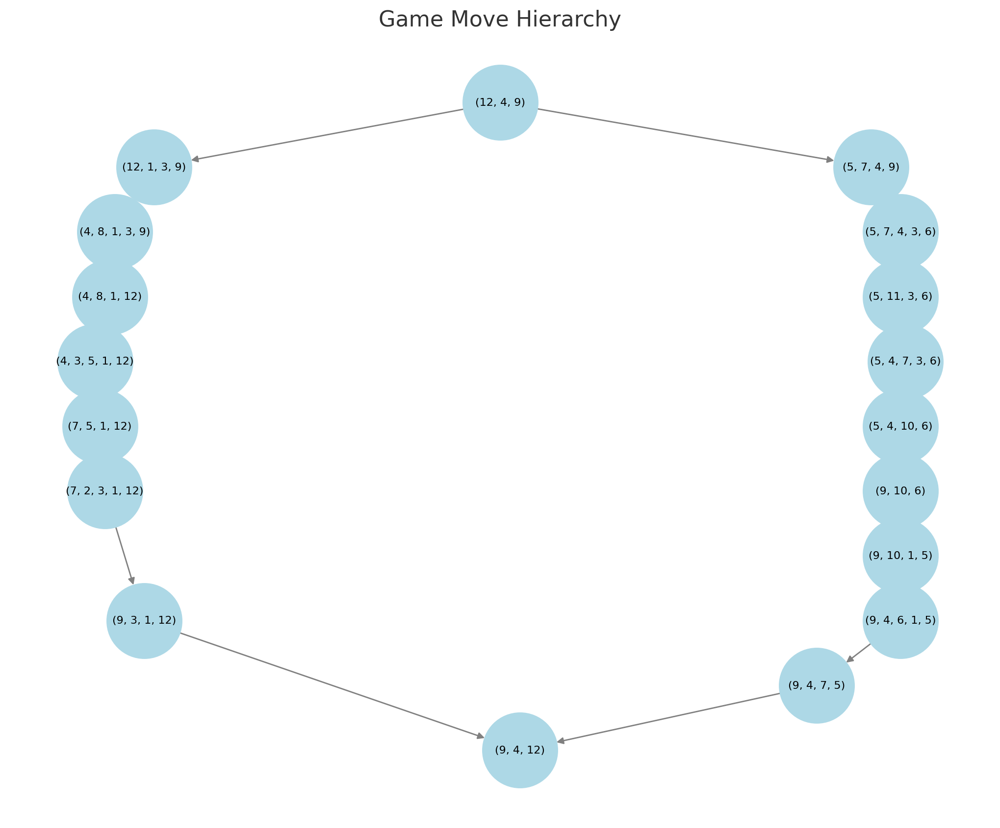

# On Computational Theory through a simple Puzzle Game

## Introduction
In the realm of puzzle games, one stands out for its intriguing blend of simplicity and complexity: a game where the objective is to reverse a list of unique integers using only two specific moves. The game begins with a list of random positive unique integers, and the challenge is to reverse this list using the fewest possible moves. The two permissible operations are: splitting an integer into two smaller integers whose sum equals the original, and combining two adjacent integers into their sum. However, these operations come with constraints: all resulting integers must remain unique and cannot exceed the largest integer in the initial list.

This puzzle game presents unique challenges that make it more than just a simple exercise in reversing a list. It requires strategic thinking and optimization, as each move must be carefully considered to ensure that the constraints are not violated. The game's appeal lies in its deceptive simplicity, masking a deep complexity that touches on various areas of computational theory. The task of finding the optimal sequence of moves resembles solving some of the most challenging problems in computer science, such as NP-hard problems, where finding a solution is easy, but finding the optimal solution is exceedingly difficult.

This puzzle serves as a fascinating entry point into discussions about computational theory, algorithmic complexity, and optimization strategies, offering insights into how simple rules can lead to complex problem-solving scenarios.

## Basic Concepts
### Unique Integers and Their Operations

In the puzzle game, the fundamental operations revolve around manipulating a list of unique integers. Each integer in the list is distinct, and the operations allowed are designed to maintain this uniqueness while transforming the list. The two primary operations are splitting and combining integers.

**Splitting an Integer:**

- **Concept:** Splitting involves taking an integer \( I \) and breaking it down into two smaller integers \( a \) and \( b \) such that \( a + b = I \). The choice of \( a \) and \( b \) must ensure that both numbers are positive and distinct from all other numbers currently in the list.
  
- **Example:** If you have an integer 9, you could split it into 4 and 5, or 3 and 6, as long as neither 4, 5, 3, nor 6 are already present in the list.

Here's a simple Python demonstration of splitting an integer:

```python
def split_integer(I, existing_numbers):
    """Splits an integer I into two distinct parts a and b such that a + b = I."""
    for a in range(1, I):
        b = I - a
        if a != b and a not in existing_numbers and b not in existing_numbers:
            return (a, b)
    return None

# Example usage
initial_list = [9, 15, 7]
result = split_integer(9, initial_list)
print(f"Splitting 9 results in: {result}")  # Output could be (4, 5) or (3, 6) depending on the existing list
```

**Combining Integers:**

- **Concept:** Combining involves taking two adjacent integers \( a \) and \( b \) in the list and merging them into their sum \( I = a + b \). The resulting integer \( I \) must be unique and not exceed the largest number from the initial list.

- **Example:** If the list contains numbers 4 and 5 next to each other, they can be combined to form 9, provided 9 is not already in the list and is not larger than the largest number in the initial list.

Here's a simple Python demonstration of combining two integers:

```python
def combine_integers(a, b, initial_max):
    """Combines two integers a and b into their sum, ensuring it doesn't exceed initial_max."""
    combined = a + b
    if combined <= initial_max:
        return combined
    return None

# Example usage
initial_max = 15
result = combine_integers(4, 5, initial_max)
print(f"Combining 4 and 5 results in: {result}")  # Output: 9
```

These operations form the core of the puzzle, allowing players to strategically manipulate the list of integers to achieve the goal of reversing their order. The challenge lies in choosing the right sequence of splits and combinations while adhering to the constraints of uniqueness and maximum value.

### Reversal of a List

In the context of this puzzle game, reversing a list involves transforming the initial sequence of unique integers into a new sequence where the order of elements is completely reversed. However, unlike typical sorting or reversing operations in programming, this game imposes specific constraints that make the task uniquely challenging.

The primary goal is not simply to reorder the elements but to achieve the reversal through a series of allowed moves: splitting and combining integers. Each move must adhere to the game's rules, ensuring that all integers remain unique and do not exceed the largest integer from the initial list.

For example, consider an initial list `[5, 3, 7]`. The desired outcome is `[7, 3, 5]`. To achieve this, one might need to perform a series of strategic splits and combinations:

1. **Split**: Break down an integer into two smaller, unique integers.
2. **Combine**: Merge two adjacent integers into their sum, provided the result is unique and within the allowed range.

These operations introduce a layer of complexity as each move can alter the list's structure, requiring careful planning to ensure the final sequence is a true reversal of the original.

The challenge is compounded by the need to minimize the number of moves, making it a problem of optimization rather than straightforward manipulation. This aspect of the game mirrors complex computational problems like those found in algorithm design and operations research, where the optimal solution is not immediately apparent and must be derived through strategic decision-making and problem-solving techniques.

## Computational Theory and Complexity

### Trees and Graphs

In the context of this puzzle game, we can represent the game states and the possible moves between them as a tree structure. Each node in the tree represents a unique configuration of the list of integers, and each edge represents a move, either a split or a combination, that transforms one configuration into another.

#### Tree Representation of Game States

- **Nodes**: Each node represents a unique state of the list of integers. The initial node is the starting configuration of the list, and the goal node is the reversed list.
- **Edges**: Each edge represents a legal move (either a split or a combine operation) that transforms one node into another. The constraints on the moves ensure that the resulting integers remain unique and do not exceed the largest integer in the initial list.

The tree structure allows us to explore all possible sequences of moves from the initial state to the goal state. By traversing this tree, we can attempt to find the shortest path (in terms of the number of moves) to achieve the goal, which is reversing the list.

#### Visualization of a Simple Tree Representation

To illustrate this concept, let's create a simple tree representation using a mock example. We'll use Python to generate a visual representation of the tree.

```python
import networkx as nx
import matplotlib.pyplot as plt

# Define the game moves as a tree structure
game_tree = nx.DiGraph()

# Define the two game runs
run_1 = {
    0: [12, 4, 9],
    1: [12, 1, 3, 9],
    2: [4, 8, 1, 3, 9],
    3: [4, 8, 1, 12],
    4: [4, 3, 5, 1, 12],
    5: [7, 5, 1, 12],
    6: [7, 2, 3, 1, 12],
    7: [9, 3, 1, 12],
    8: [9, 4, 12],
}

run_2 = {
    0: [12, 4, 9],
    1: [5, 7, 4, 9],
    2: [5, 7, 4, 3, 6],
    3: [5, 11, 3, 6],
    4: [5, 4, 7, 3, 6],
    5: [5, 4, 10, 6],
    6: [9, 10, 6],
    7: [9, 10, 1, 5],
    8: [9, 4, 6, 1, 5],
    9: [9, 4, 7, 5],
    10: [9, 4, 12],
}

# Add nodes and edges for Run 1
for i in range(len(run_1) - 1):
    game_tree.add_edge(tuple(run_1[i]), tuple(run_1[i + 1]))

# Add nodes and edges for Run 2
for i in range(len(run_2) - 1):
    game_tree.add_edge(tuple(run_2[i]), tuple(run_2[i + 1]))

# Create the tree visualization
plt.figure(figsize=(10, 8))
pos = nx.nx_agraph.graphviz_layout(game_tree, prog="dot")  # Use a hierarchical layout
nx.draw(game_tree, pos, with_labels=True, node_size=3000, node_color="lightblue", edge_color="gray", font_size=8)

plt.title("Game Move Hierarchy")
plt.show()
```


In this visualization, we have a simple tree with a few states and transitions. The "Start" node represents the initial state of the list `[3, 7, 5]`. From this state, we can perform different moves, represented by edges, leading to new states. The goal is to reach the "State 3" node, which represents the reversed list `[2, 3, 7, 5]`.

This tree-based approach helps us understand the potential paths and strategies we can use to solve the puzzle efficiently by finding the shortest sequence of moves.

In reality as we scale the length of the initial list, the amount of possible moves (nodes) and resulting list states (edges) becomes very large and it becomes impractical to explore the whole space of possibilities.
Here is a network of three valid solutions to the same initial list, showing the possibilities. The blue node is the initial start list, and the green node, the end state.

Note that you have to think about all possible moves that lead to dead ends too, which are not shown here:


### NP-Hardness and Optimization Problems

The puzzle game of reversing a list of unique integers using only splitting and combining operations presents a fascinating challenge in computational theory, particularly in the realm of optimization problems. The task of finding the shortest sequence of moves to achieve the reversal is analogous to solving NP-hard problems, such as the Traveling Salesman Problem (TSP).

In computational complexity theory, an NP-hard problem is one for which no known polynomial-time algorithm can solve all instances of the problem. These problems are significant because they encapsulate the difficulty of efficiently solving complex computational tasks. The puzzle game's requirement to reverse the list with the minimal number of operations shares this complexity. Each potential move—splitting or combining integers—can be thought of as a step in a solution path, similar to a path between cities in TSP.

The complexity arises from the vast number of possible game states and the operations that can be performed at each step. As the number of integers increases, the number of possible moves grows exponentially, making it impractical to evaluate all possible sequences of moves to determine the optimal one. This is where optimization techniques come into play.

Optimization problems like this game often require heuristic methods or approximation algorithms to find a satisfactory solution within a reasonable time frame. Techniques such as dynamic programming, greedy algorithms, or even machine learning models can be employed to explore the solution space more efficiently than brute force methods.

In summary, the puzzle game serves as an illustrative example of an NP-hard problem, demonstrating the challenges in finding optimal solutions in computational theory. It highlights the need for advanced optimization strategies to navigate the complexity inherent in such problems, bridging the gap between theoretical computer science and practical problem-solving.

## Strategies for Solving the Game

### Brute Force and Exhaustive Search

The brute force approach to solving the puzzle game involves exploring all possible sequences of moves to reverse the list of integers. This method systematically examines every potential move at each step, ensuring that no possible solution is overlooked. While this guarantees finding a solution if one exists, it is computationally expensive due to the exponential growth of possibilities as the number of integers increases.

In this context, brute force essentially means generating all possible game states by applying all valid moves (splitting and combining) and checking if any of these states result in the reversed list. The challenge lies in the sheer number of combinations and permutations that need to be evaluated, making this method impractical for large lists.

Here's a simple Python function that demonstrates a brute force approach to explore possible moves:

```python
def split_integer(n):
    """Generate all possible splits of an integer n into two unique integers."""
    return [(i, n - i) for i in range(1, n // 2 + 1)]

def combine_integers(a, b):
    """Combine two integers into their sum."""
    return a + b

def brute_force_reverse(initial_list):
    """Attempt to reverse the list using a brute force approach."""
    def explore(state, path):
        if state == initial_list[::-1]:
            return path
        
        for i in range(len(state)):
            # Try splitting
            if state[i] > 1:
                for a, b in split_integer(state[i]):
                    new_state = state[:i] + [a, b] + state[i+1:]
                    if len(set(new_state)) == len(new_state):
                        result = explore(new_state, path + [(state, new_state)])
                        if result:
                            return result
            
            # Try combining
            if i < len(state) - 1:
                combined = combine_integers(state[i], state[i+1])
                if combined <= max(initial_list):
                    new_state = state[:i] + [combined] + state[i+2:]
                    if len(set(new_state)) == len(new_state):
                        result = explore(new_state, path + [(state, new_state)])
                        if result:
                            return result
                        
        return None

    return explore(initial_list, [])

# Example usage
initial_list = [7, 3, 5]
solution_path = brute_force_reverse(initial_list)
if solution_path:
    for step in solution_path:
        print(f"Move from {step[0]} to {step[1]}")
else:
    print("No solution found")
```

This code attempts to reverse the list by recursively exploring all possible moves. It checks each state to see if it matches the reversed list and returns the path of moves if successful. While this approach is not efficient for large lists, it serves as a foundational technique for understanding the problem space and potential solutions.

### Pruning and Optimization Techniques

In the context of solving our puzzle game, pruning and optimization techniques are essential for efficiently navigating the vast search space of possible moves. These techniques help eliminate paths that are unlikely to lead to an optimal solution, thereby reducing the computational effort required to find the shortest sequence of moves to reverse the list.

#### Pruning Techniques

Pruning is a strategy used to cut off branches of the search tree that do not need to be explored. In our game, this can be achieved by identifying and discarding moves that would lead to redundant or non-promising states. Here are some common pruning strategies:

1. **Duplicate State Pruning**: Avoid revisiting states that have already been explored. This can be implemented by maintaining a set of visited states.

2. **Bounded Search Pruning**: If a partial solution already exceeds the known best solution in terms of the number of moves, it can be discarded early.

3. **Heuristic-Based Pruning**: Use heuristics to estimate the cost of reaching the goal from the current state. If a move seems less promising based on heuristic evaluations, it can be pruned.

#### Implementing a Basic Pruning Strategy in Python

Below is a simple Python implementation that demonstrates a basic pruning strategy using a breadth-first search (BFS) approach with duplicate state pruning.

```python
from collections import deque

def split_integer(I):
    """Generate all possible splits of an integer I."""
    return [(a, I - a) for a in range(1, I // 2 + 1)]

def combine_integers(a, b):
    """Combine two integers into their sum."""
    return a + b

def is_valid_state(state, max_value):
    """Check if the state is valid with unique integers and no integer larger than max_value."""
    return len(state) == len(set(state)) and all(x <= max_value for x in state)

def reverse_list_with_pruning(initial_list):
    """Attempt to reverse the list using BFS with pruning."""
    max_value = max(initial_list)
    target_state = initial_list[::-1]
    queue = deque([(initial_list, 0)])
    visited = set()

    while queue:
        current_state, moves = queue.popleft()

        if current_state == target_state:
            return moves

        # Prune if this state has already been visited
        state_tuple = tuple(current_state)
        if state_tuple in visited:
            continue
        visited.add(state_tuple)

        # Generate possible next states
        for i in range(len(current_state)):
            # Try splitting
            for a, b in split_integer(current_state[i]):
                new_state = current_state[:i] + [a, b] + current_state[i+1:]
                if is_valid_state(new_state, max_value):
                    queue.append((new_state, moves + 1))

            # Try combining with the next integer
            if i < len(current_state) - 1:
                combined_value = combine_integers(current_state[i], current_state[i+1])
                new_state = current_state[:i] + [combined_value] + current_state[i+2:]
                if is_valid_state(new_state, max_value):
                    queue.append((new_state, moves + 1))

    return -1  # Return -1 if no solution is found

# Example usage:
initial_list = [4, 3, 2, 1]
moves_required = reverse_list_with_pruning(initial_list)
print(f"Minimum moves required to reverse the list: {moves_required}")
```

This code leverages a BFS approach to explore possible states of the list while using a set to track visited states, effectively pruning duplicate states from the search space. The `split_integer` and `combine_integers` functions generate possible moves, and `is_valid_state` ensures that resulting states adhere to the game's constraints. This approach helps manage the complexity of the problem by focusing on promising paths and avoiding redundant calculations.

### Local Minima and Global Solutions

In the context of the puzzle game, the concept of local minima refers to a situation where a sequence of moves seems optimal in the short term but does not lead to the overall best solution, which is reversing the list in the fewest moves possible. This is analogous to finding a low point in a landscape that is not the lowest possible point (the global minimum).

#### Understanding Local Minima

When solving the game, players might find themselves in a position where the sequence of moves seems to progress towards the solution but actually leads to a dead-end or a suboptimal configuration. This can happen if the focus is too narrow, optimizing for immediate gains (like quickly reversing a part of the list) without considering the long-term implications (like the overall sequence of moves needed).

To avoid getting trapped in local minima, players need strategies that allow them to explore the solution space more effectively, ensuring that they consider moves that might initially seem counterintuitive but lead to a better overall outcome.

#### Strategies to Avoid Local Minima

1. **Backtracking:** This involves reversing recent moves to explore alternative paths. If a particular sequence leads to a dead-end, backtracking allows the player to return to a previous state and try a different approach.

2. **Heuristics:** Implementing heuristic methods can guide the search process. For example, prioritizing moves that increase the symmetry of the list or that bring larger numbers closer to their target positions can be effective.

3. **Simulated Annealing:** This probabilistic technique allows for occasional acceptance of suboptimal moves to escape local minima, gradually reducing the probability of such moves as the solution space is explored.

4. **Genetic Algorithms:** These involve simulating evolution to explore multiple paths simultaneously, combining successful sequences of moves to find an optimal solution.

Here is a simple Python example to illustrate the concept of avoiding local minima using a basic heuristic approach:

```python
def heuristic_reverse(lst):
    """A simple heuristic approach to reverse the list by prioritizing larger moves."""
    target = lst[::-1]
    current = lst[:]
    moves = []
    
    while current != target:
        for i in range(len(current) - 1):
            if current[i] + current[i + 1] <= max(lst) and (current[i] + current[i + 1]) not in current:
                # Combine two adjacent numbers if it brings us closer to the target
                combined = current[i] + current[i + 1]
                new_list = current[:i] + [combined] + current[i+2:]
                if new_list[::-1] == target:
                    current = new_list
                    moves.append(f"Combine {current[i]} and {current[i+1]}")
                    break
            elif current[i] > 1:
                # Split the number if it helps in making progress
                a = current[i] // 2
                b = current[i] - a
                if a != b and a not in current and b not in current:
                    new_list = current[:i] + [a, b] + current[i+1:]
                    if new_list[::-1] == target:
                        current = new_list
                        moves.append(f"Split {current[i]} into {a} and {b}")
                        break
    return moves

# Example usage
initial_list = [5, 3, 2]
print(heuristic_reverse(initial_list))
```

This code provides a basic framework for exploring moves with a simple heuristic, aiming to avoid local minima by considering both combining and splitting operations that seem beneficial in the context of reaching the target list.

## Advanced Topics
### Turing Completeness and Game Representation

The concept of Turing completeness is central to understanding the computational power of a system. A system is Turing complete if it can simulate a Turing machine, meaning it can perform any computation that can be described algorithmically, given enough time and resources. While the puzzle game described may not initially seem to have the complexity of a Turing machine, its representation as a computational problem offers intriguing insights into its theoretical implications.

In the context of this game, the operations of splitting and combining integers can be seen as basic computational steps. These operations, when combined with the goal of reversing the list, create a complex problem space that can be represented as a state machine. Each state in this machine corresponds to a particular configuration of the list, and transitions between states are governed by the allowed operations (splitting and combining).

To explore the Turing completeness of the game, consider how it can be represented using a computational model:

1. **State Representation**: Each unique configuration of the list can be viewed as a state. The initial state is the original list, and the goal state is the reversed list.

2. **Transitions**: The operations of splitting and combining integers act as transitions between states. Each operation modifies the list, moving the game from one state to another.

3. **Computation**: The sequence of operations needed to reach the goal state from the initial state can be seen as a computation. If this sequence can be determined algorithmically for any initial configuration, the game exhibits properties akin to computational problems solved by Turing machines.

4. **Complexity**: The complexity of finding an optimal solution (the shortest sequence of operations) relates to the complexity classes studied in computer science. Specifically, the need to explore numerous potential sequences of operations to find the optimal one mirrors the challenges in NP-hard problems, suggesting that the game has a rich computational structure.

While the puzzle game itself may not be Turing complete in the strictest sense (as it is not designed to perform arbitrary computations), its representation as a computational problem allows for the exploration of its complexity and potential simulation of computational processes. This exploration provides a fascinating intersection of game theory, computational complexity, and theoretical computer science, offering insights into how seemingly simple games can model complex systems.

### Function and Algorithm Time Complexity

Analyzing the time complexity of solving the puzzle game involves understanding the computational effort required by different approaches to reverse the list using the allowed operations. Here, we'll explore the time complexity of two primary strategies: brute force and optimized search techniques.

#### Brute Force Approach

The brute force method involves exploring all possible sequences of moves to reverse the list. This approach is straightforward but computationally expensive, as it examines every possible combination of splits and combines, leading to a combinatorial explosion of possibilities.

- **Time Complexity**: The time complexity of the brute force approach can be considered exponential, denoted as \(O(2^n \cdot n!)\), where \(n\) is the number of integers in the list. This complexity arises because each integer can be split in multiple ways, and each sequence of integers can be combined in numerous permutations, leading to a vast number of potential game states.

#### Optimized Search with Pruning

To improve upon the brute force method, optimization techniques such as pruning can be employed. Pruning strategies aim to reduce the search space by eliminating paths that are unlikely to lead to an optimal solution, thereby avoiding unnecessary computations.

- **Time Complexity**: The time complexity of an optimized search with pruning is difficult to express precisely, as it depends on the effectiveness of the pruning strategy. However, in general, it significantly reduces the search space compared to brute force, potentially lowering the complexity to a more manageable level. The complexity might be closer to \(O(b^d)\), where \(b\) is the branching factor (average number of child nodes per parent node after pruning) and \(d\) is the depth of the search tree.

#### Example Code for Complexity Analysis

Below is a simple Python code snippet that demonstrates the brute force approach and a basic pruning strategy. This code is not exhaustive but provides a conceptual framework for understanding how these strategies might be implemented.

```python
def brute_force_reverse(lst, max_depth, depth=0):
    if lst == lst[::-1]:
        return True
    if depth >= max_depth:
        return False
    # Try all possible splits and combines
    for i in range(len(lst)):
        for j in range(i + 1, len(lst)):
            new_lst = lst[:i] + [lst[i] + lst[j]] + lst[j+1:]
            if len(set(new_lst)) == len(new_lst):
                if brute_force_reverse(new_lst, max_depth, depth + 1):
                    return True
    return False

def optimized_reverse(lst, max_depth, depth=0, visited=set()):
    if tuple(lst) in visited:
        return False
    visited.add(tuple(lst))
    
    if lst == lst[::-1]:
        return True
    if depth >= max_depth:
        return False
    # Try all possible splits and combines with pruning
    for i in range(len(lst)):
        for j in range(i + 1, len(lst)):
            new_lst = lst[:i] + [lst[i] + lst[j]] + lst[j+1:]
            if len(set(new_lst)) == len(new_lst):
                if optimized_reverse(new_lst, max_depth, depth + 1, visited):
                    return True
    return False

# Example usage
initial_list = [3, 1, 2]
max_depth = 10
print("Brute Force Result:", brute_force_reverse(initial_list, max_depth))
print("Optimized Result:", optimized_reverse(initial_list, max_depth))
```

In this code, `brute_force_reverse` attempts to reverse the list by exploring all possible combinations, while `optimized_reverse` uses a set to track visited states, effectively pruning the search space by avoiding revisiting the same state. This simple optimization can significantly reduce the number of states explored, demonstrating how pruning can improve the efficiency of the search.

## Conclusion

Through exploring this puzzle game, we have gained valuable insights into several key concepts in computational theory and algorithmic problem-solving:

1. **Understanding Unique Operations**: We learned how the game’s operations—splitting and combining integers under specific constraints—mirror complex decision-making processes found in computational tasks. These operations taught us about maintaining uniqueness and managing constraints effectively.

2. **Complexity and NP-Hardness**: The challenge of reversing the list with minimal moves introduced us to the complexity of NP-hard problems. This understanding helps appreciate why finding optimal solutions in computational problems can be so demanding and resource-intensive.

3. **Tree Structures and Game State Representation**: By representing game states as tree structures, we visualized the decision-making process and explored how different states are interconnected. This approach is crucial for understanding how algorithms navigate through potential solutions.

4. **Brute Force vs. Optimization**: We contrasted brute force methods with optimization strategies like pruning. This comparison highlighted the importance of efficiency in algorithm design, showing how pruning can significantly reduce computational overhead by eliminating unnecessary paths.

5. **Avoiding Local Minima**: The game illustrated the concept of local minima and the need for strategies to avoid suboptimal solutions. This is a common challenge in optimization problems, emphasizing the importance of global search strategies.

6. **Theoretical Implications**: Finally, discussing the game in the context of Turing completeness and time complexity provided a deeper appreciation for the theoretical underpinnings of computational problems, reinforcing the interdisciplinary nature of these challenges.

This puzzle game serves as an engaging platform to explore and understand foundational concepts in computational theory, offering practical applications and theoretical insights that are relevant across various domains in computer science.


